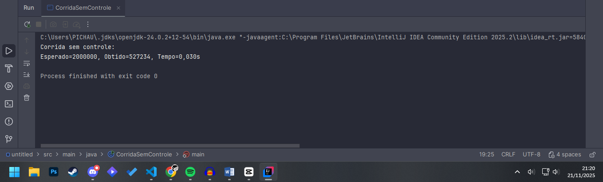
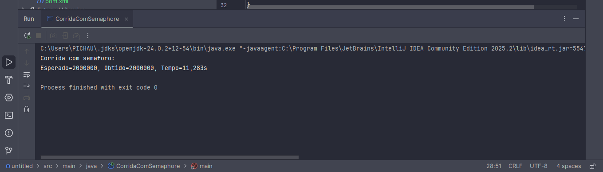
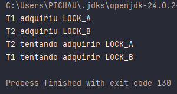
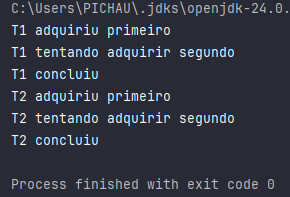

# Trabalho: Performance em Sistemas Ciberfísicos — TDE3

## Parte 1 — Jantar dos Filósofos

O **Jantar dos Filósofos** modela cinco filósofos sentados em uma mesa circular, alternando entre *pensar* e *comer*. Para comer cada filósofo precisa dos dois garfos à sua esquerda e direita (compartilhados com os vizinhos). O protocolo ingênuo — “pegar primeiro um garfo, depois o outro” — pode levar a **deadlock** quando todos pegam o garfo da esquerda e aguardam o da direita.

As **condições de Coffman** aplicáveis são:

1. **Exclusão mútua** — recursos exclusivos (garfos).  
2. **Hold-and-wait (manter-e-esperar)** — filósofos seguram um garfo e esperam o outro.  
3. **Não-preempção** — não é possível forçar a liberação do garfo.  
4. **Espera circular** — existe um ciclo de dependência entre filósofos/garfos.

**Solução proposta:** impor uma **hierarquia de recursos** — ordenar os garfos por índice e exigir que cada filósofo adquira primeiro o garfo de **menor índice** e depois o de maior índice. Isso **quebra a condição de espera circular**.

### Pseudocódigo (hierarquia de recursos)
```java
Dados:
N = 5
garfos = [0 .. N-1] // garfo i fica entre filósofo i e (i+1)%N

Para cada filósofo p executar em thread separada:
leftForkIndex = p
rightForkIndex = (p + 1) % N

// impor ordem:
first = min(leftForkIndex, rightForkIndex)
second = max(leftForkIndex, rightForkIndex)

Loop infinito:
pensar() // tempo aleatório
estado[p] <- "com fome" // log opcional
adquirir(first) // bloqueia até o garfo livre
log("P" + p + " adquiriu garfo " + first)
adquirir(second)
log("P" + p + " adquiriu garfo " + second)
estado[p] <- "comendo"
comer() // tempo aleatório
liberar(second)
log("P" + p + " liberou garfo " + second)
liberar(first)
log("P" + p + " liberou garfo " + first)
estado[p] <- "pensando"
```

---

## Parte 2 — Threads e Semáforos (contador concorrente)

Esses trechos demonstram (1) a condição de corrida ao incrementar uma variável compartilhada sem sincronização e (2) a correção usando `Semaphore(1, true)`.

### Código — versão com condição de corrida (sem sincronização)

```java
import java.util.concurrent.*;

public class CorridaSemControle {
    static int count = 0;
    public static void main(String[] args) throws Exception {
        int T = 8;
        int M = 250_000;
        ExecutorService pool = Executors.newFixedThreadPool(T);
        Runnable r = () -> {
            for (int i = 0; i < M; i++) {
                count++; // não atômico -> condição de corrida
            }
        };
        long t0 = System.nanoTime();
        for (int i = 0; i < T; i++) pool.submit(r);
        pool.shutdown();
        pool.awaitTermination(2, TimeUnit.MINUTES);
        long t1 = System.nanoTime();
        System.out.printf("Esperado=%d, Obtido=%d, Tempo=%.3fs%n",
                (long) T * M, count, (t1 - t0) / 1e9);
    }
}
```
RESULTADO:



Código — versão correta com Semaphore(1, true) (binário justo)
```java
import java.util.concurrent.*;

import java.util.concurrent.*;

public class CorridaComSemaphore {
    static int count = 0;
    static final Semaphore sem = new Semaphore(1, true); // fair = true (FIFO)
    public static void main(String[] args) throws Exception {
        int T = 8;
        int M = 250_000;
        ExecutorService pool = Executors.newFixedThreadPool(T);
        Runnable r = () -> {
            for (int i = 0; i < M; i++) {
                try {
                    sem.acquire();
                    count++;
                } catch (InterruptedException e) {
                    Thread.currentThread().interrupt();
                    return;
                } finally {
                    sem.release();
                }
            }
        };
        long t0 = System.nanoTime();
        for (int i = 0; i < T; i++) pool.submit(r);
        pool.shutdown();
        pool.awaitTermination(2, TimeUnit.MINUTES);
        long t1 = System.nanoTime();
        System.out.printf("Esperado=%d, Obtido=%d, Tempo=%.3fs%n",
                (long) T * M, count, (t1 - t0) / 1e9);
    }
}
```
RESULTADO:



Observação: Semaphore(1, true) garante exclusão mútua e fairness; Obtido tende a igualar Esperado, porém o tempo pode aumentar devido à serialização.

Parte 3 — Deadlock
Código que produz deadlock (reprodução)
```java
Copiar código
public class DeadlockDemo {
    static final Object LOCK_A = new Object();
    static final Object LOCK_B = new Object();

    public static void main(String[] args) {
        Thread t1 = new Thread(() -> {
            synchronized (LOCK_A) {
                System.out.println("T1 adquiriu LOCK_A");
                dormir(50);
                System.out.println("T1 tentando adquirir LOCK_B");
                synchronized (LOCK_B) {
                    System.out.println("T1 concluiu");
                }
            }
        });

        Thread t2 = new Thread(() -> {
            synchronized (LOCK_B) {
                System.out.println("T2 adquiriu LOCK_B");
                dormir(50);
                System.out.println("T2 tentando adquirir LOCK_A");
                synchronized (LOCK_A) {
                    System.out.println("T2 concluiu");
                }
            }
        });

        t1.start();
        t2.start();
    }

    static void dormir(long ms) {
        try { Thread.sleep(ms); } catch (InterruptedException e) { Thread.currentThread().interrupt(); }
    }
}
```
RESULTADO: <br>



Esse programa normalmente imprime as mensagens até os dois tentando adquirir ... e então fica travado — nenhum concluiu aparece.

Correção por hierarquia de recursos
```java
Copiar código
public class DeadlockCorrigido {
    static final Object LOCK_A = new Object();
    static final Object LOCK_B = new Object();

    public static void main(String[] args) {
        Thread t1 = new Thread(() -> {
            adquirirNaOrdem(LOCK_A, LOCK_B, "T1");
        });

        Thread t2 = new Thread(() -> {
            adquirirNaOrdem(LOCK_A, LOCK_B, "T2"); // mesma ordem que T1
        });

        t1.start();
        t2.start();
    }

    static void adquirirNaOrdem(Object first, Object second, String name) {
        synchronized (first) {
            System.out.println(name + " adquiriu primeiro");
            dormir(50);
            System.out.println(name + " tentando adquirir segundo");
            synchronized (second) {
                System.out.println(name + " concluiu");
            }
        }
    }

    static void dormir(long ms) {
        try { Thread.sleep(ms); } catch (InterruptedException e) { Thread.currentThread().interrupt(); }
    }
}
```
RESULTADO: <br>



Vídeo explicativo:
[](https://youtu.be/BwYGKeI1Pes?si=0LzumxFpxWXaonKS)
